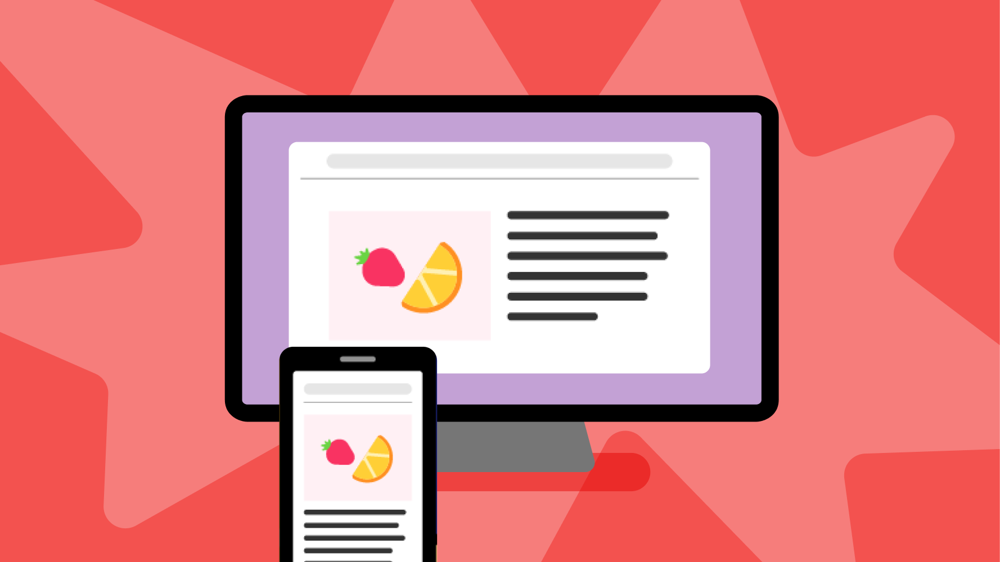

### Choose your project type

### Logging in

## Introduction

The Raspberry Pi Editor can be used to write and run code in a web browser without installing any additional software and without the need to create an account (although if you’re logged in to a Raspberry Pi Foundation account, your coding project is automatically saved).

**TODO:** Update this vvvv

 The brand new <a href="https://projects.raspberrypi.org/en/pathways/microbit-intro">Introduction to micro:bit path</a> will help you take your first steps with the BBC micro:bit. Along the way you will create projects that are fun, and help you manage your wellbeing!

### What you will make

You will take a tour of the Raspberry Pi Editor. You will write a simple web page in HTML.

**TODO:** Update this vvvv

The rest of this project will guide you through the features of the Editor!

--- collapse ---
---
title: What you will need
---
### Hardware

+ A computer

### Software

+ A browser to run the Editor

--- /collapse ---

--- collapse ---
---
title: What you will learn
---

+ How to log in
+ What the different panels are
+ How to resize the panels
+ How to name a project
+ How to add/rename/delete a file
+ How to change to dark mode / light mode
+ How to change the text size
+ How to run your code
+ How to download a project

--- /collapse ---