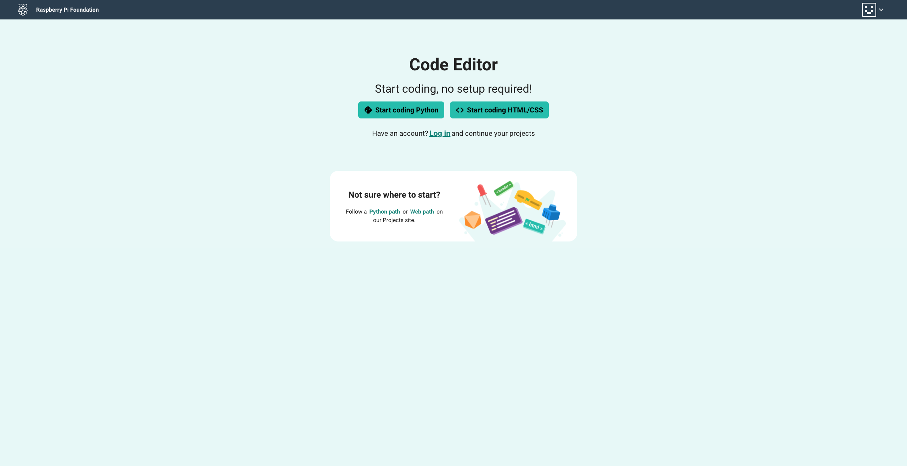
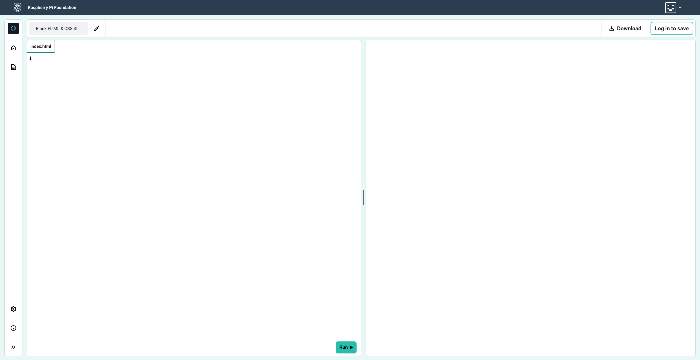
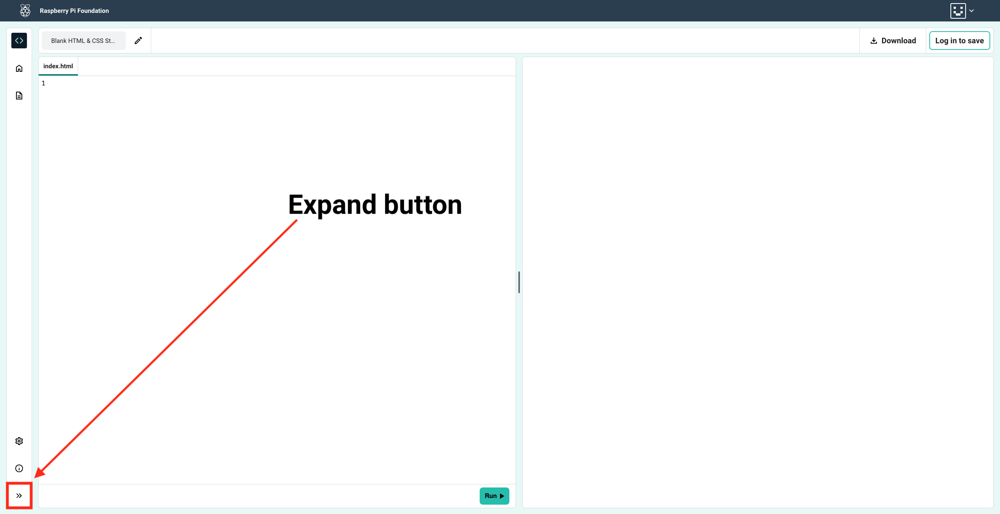

## Editor homepage

In this step, you will see how you can create your first HTML project and log in to the Raspberry Pi Editor! 

You can access the [Raspberry Pi Editor here](https://editor.raspberrypi.org/en/){:target="_blank"}.

### Start coding HTML!

--- task ---

Click on the `Start coding HTML/CSS` button.

--- /task ---

--- collapse ---

---
title: Log in
---

If you have a Raspberry Pi account, you can log in to save your projects.

You can log in from the link in the middle of the homepage screen:

...or from the Account menu at the top right:

--- /collapse ---

The Raspberry Pi Editor will open with a blank project.

--- task ---

The expand button is at the bottom left of the Editor. 

Click it to show the sidebar panel.

The Project files panel will open.

The blank project has two files: `index.html` and `styles.css`.

--- /task ---
