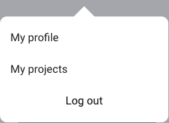
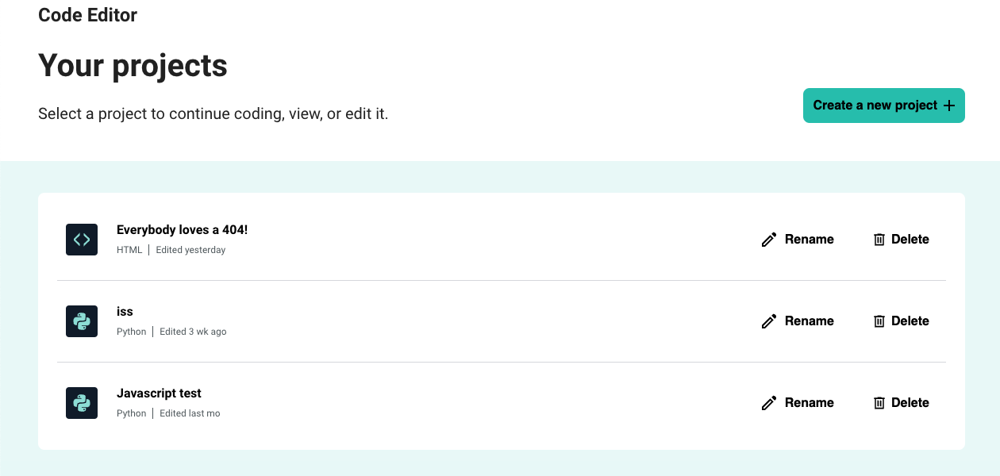

## Your account and projects

You can access the Account menu from the top right of the Code Editor.

When logged in, you will be able to access:
+ My profile
+ My projects
+ Log out

Clicking **My projects** will take you to the 'Your projects' page.

Here, you can create a new project and see the projects list, where you have the option to continue, rename, or delete a project.

To return to the Code Editor, you can:
+ Choose a saved project
+ Create a new project
+ Click the back button in your browser
