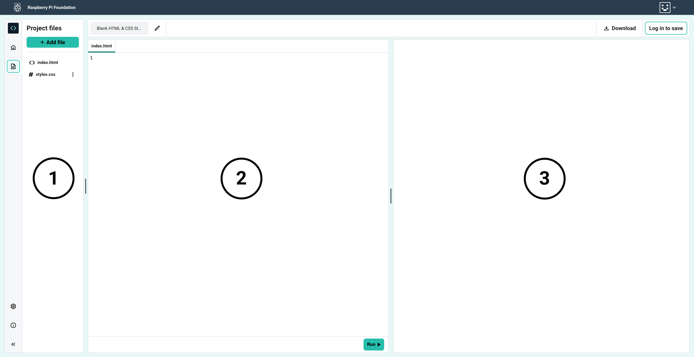

## Editor tour

This screenshot shows the three main panels:
1) The Sidebar panel on the left
2) The Code panel in the middle
3) The Preview panel on the right

### Resize the panels

You can resize the panels using the handles.

### Adaptive layout

The layout will adapt if you resize your browser window, or if you are working on a device with a smaller screen size.

This screenshot shows the three main panels in an adapted layout, with the Preview panel vertically below the Code panel.

### Project bar

The project bar is at the top of the page and shows:

+ The name of your project, with an edit button, so you can change the project name.
+ A button to let you download your project files.
+ A link to log in. This changes to ‘save’ when you are logged in.
