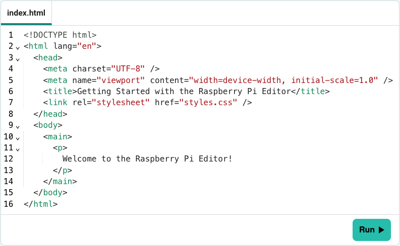

## The Code and Preview panels

The file name is at the top of the panel. 

In this example, the file name is `index.html`.

The Code panel includes the following features: 

--- collapse ---
---
title: Line numbering
---

When you type new lines of code in the Editor, line numbers will be added for you. 

Line numbering helps you keep track of where you are in your project and helps you work with others on your code.

--- /collapse ---

--- collapse ---
---
title: Syntax highlighting
---

Syntax highlighting improves the readability of code by applying colours and styles to different elements based on the language's syntax (the 'rules' of the language). 

It helps distinguish different parts of the code and is a valuable tool for developers, making code more accessible.

In this example, you can see that the Editor highlights each opening and closing tag in green. Values are highlighted in red.

--- /collapse ---

--- collapse ---
---
title: Indentation
---

The Editor will automatically format your code by adding spaces to create a visual structure. 

Indentation does not affect how the HTML document is displayed in a browser, but it helps make code more readable and easier to edit.

In this example, you can see that the `<head>` and `<body>` elements are nested in the `<html>` tags — they are known as 'child' elements, under their 'parent' `<html>`.

Here is the structure, shown as a hierarchy.
 
--- code ---
---
language: html
filename: index.html
---

<!DOCTYPE html>
|
└─ <html>
   |
   └─ <head>
   |  |
   |  ├─ <meta>
   |  |
   |  ├─ <meta>
   |  |
   |  ├─ <title>
   |  |
   |  └─ <link>
   |  
   └─ <body>
      |
      └─ <main>
         |
         └─ 

            |
            └─ Welcome to the Raspberry Pi Editor!

--- /code ---

--- /collapse ---

--- task ---

### Try it

Add this HTML to your project.

--- code ---
---
language: html
filename: index.html
line_numbers: true
line_number_start: 1
line_highlights:
---

<!DOCTYPE html>
<html lang="en">
  <head>
    <meta charset="UTF-8" />
    <meta name="viewport" content="width=device-width, initial-scale=1.0" />
    <title>Getting started with the Raspberry Pi Editor</title>
    <link rel="stylesheet" href="styles.css" />
  </head>
  <body>
    <main>
      

        Welcome to the Raspberry Pi Editor!
      

    </main>
  </body>
</html>

--- /code ---

**Notice** the line numbering, syntax highlighting, and indentation.

**Test:** 

+ Click the **Run** button.
+ Your code will be rendered in the Preview panel.

--- /task ---

--- print-only ---

--- /print-only ---

--- task ---

### Style it!

Open the file `styles.css`

Add this CSS to your project.

--- code ---
---
language: css
filename: styles.css
line_numbers: true
line_number_start: 1
line_highlights:
---

p {
  font-size: 4cqh;
  padding-left: 5vw;
}

--- /code ---

**Notice** the line numbering, syntax highlighting, and indentation.

**Test:** 

+ Click the **Run** button
+ Your code will be rendered in the Preview panel
+ The text will be bigger and padded (indented) on the left

--- /task ---

