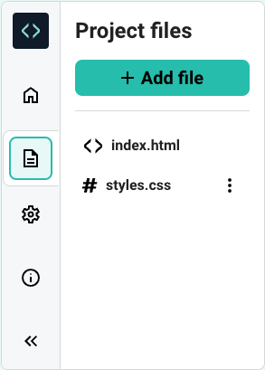
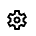
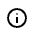

## Sidebar panel

Here is the expanded Sidebar panel.

(The Project files are shown by default.)

### Sidebar panels

There are six icons on the left.

The Editor logo is top:

There are five other icons, one for each sidebar panel.

--- collapse ---
---
title:  Project Information
---

Name (and edit button), Type, and Download link

--- /collapse ---

--- collapse ---
---
title: What are the Sidebar icons?
---

--- /collapse ---

--- collapse ---
---
title: What are the Sidebar icons?
---

--- /collapse ---

--- collapse ---
---
title: What are the Sidebar icons?
---

--- /collapse ---

--- collapse ---
---
title: What are the Sidebar icons?
---

--- /collapse ---

1) Project files
2) Settings
3) Editor Information
4) Collapse

The sub-panels are explored in detail here:

--- collapse ---
---
title: What are the Sidebar icons?
---
1) Project files:
    
    

2) Settings:
    
    
3) Editor Information:
    
    
4) Collapse:
    
    

--- /collapse ---

### Project files

When you open a blank HTML/CSS project, you are provided with two Project files: `index.html` and `styles.css`

Projects
Current project name (+ edit)
Project
Download
Project files
Add file
File list
Rename option
Settings
Light/dark Theme
Text size
Information
Hide/show sidebar
