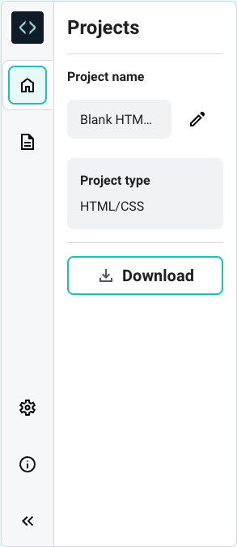
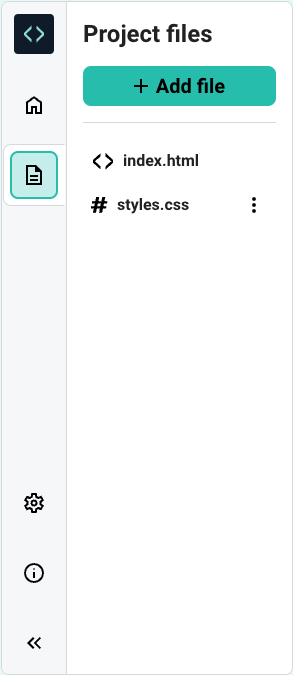
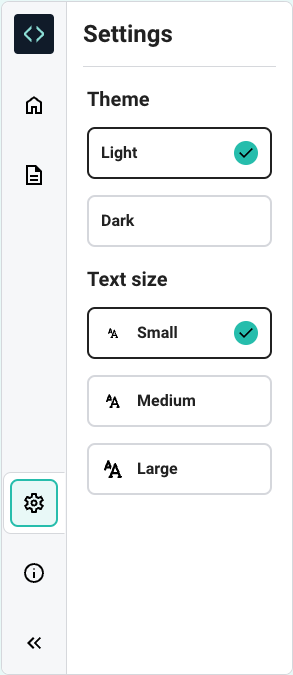
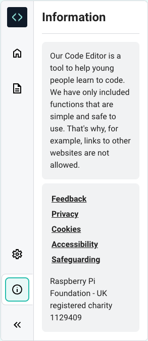

## Sidebar panel

Here is the expanded Sidebar panel.

(The Project files are shown by default.)

### Sidebar panels

There are six icons on the left.

The Editor logo is top.

There are five other icons, one for each sidebar panel.

--- collapse ---
---
title: Project Information
---

+ Name (and edit button)
+ Type
+ Button to download your project files.

--- /collapse ---

--- collapse ---
---
title: Project files
---

When you open a blank HTML/CSS project, you are provided with two Project files: `index.html` and `styles.css`

You can click the `Add file` button to add a new HTML, CSS or JavaScript file

--- /collapse ---

--- collapse ---
---
title: Settings
---

+ Theme: Light or Dark mode
+ Text size: Small, Medium or Large

--- /collapse ---

--- collapse ---
---
title: Editor Information
---

+ The purpose of the Raspberry Pi Editor
+ Links to policies
+ UK registered charity information

--- /collapse ---

--- collapse ---
---
title: The collapse button
---

Click `<<` to hide the Sidebar.

Click `>>` to expand the Sidebar.

--- /collapse ---
